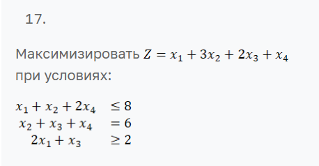
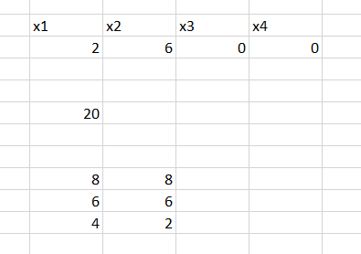

# Лабораторная работа №1: Решение задач линейного программирования

## Студент

**Ф.И.О. | Поток:** Якшин Артемий Максимович | 1.1
**Вариант:** 17

---

## Постановка задачи



**Максимизировать:** Z = x₁ + 3x₂ + 2x₃ + x₄

**При условиях:**

- x₁ + x₂ + 2x₄ ≤ 8
- x₂ + x₃ + x₄ = 6
- 2x₁ + x₃ ≥ 2
- x₁, x₂, x₃, x₄ ≥ 0

---

## Алгоритм решения (псевдокод)

### Двухфазный симплекс-метод

```
АЛГОРИТМ SimplexSolver(c, A, b, constraint_types, problem_type):

    // ШАГ 1: ПРИВЕДЕНИЕ К КАНОНИЧЕСКОМУ ВИДУ
    ФУНКЦИЯ to_canonical_form(c, A, b, constraint_types):
        ДЛЯ каждого ограничения i:
            ЕСЛИ b[i] < 0:
                A[i] = -A[i]
                b[i] = -b[i]
                инвертировать тип ограничения[i]

        ЕСЛИ problem_type == MINIMIZE:
            c = -c

        ДЛЯ каждого ограничения i:
            ЕСЛИ тип == LEQ (<=):
                добавить slack-переменную (коэф. +1)
            ИНАЧЕ ЕСЛИ тип == GEQ (>=):
                добавить surplus-переменную (коэф. -1)

        ВЕРНУТЬ (A_canon, b_canon, c_canon, n_original)


    // ШАГ 2: ФАЗА 1 - ПОИСК НАЧАЛЬНОГО ДОПУСТИМОГО РЕШЕНИЯ
    ФУНКЦИЯ phase1(A, b):
        // Добавить искусственные переменные для всех ограничений
        A_aux = [A | I]  // I - единичная матрица размера m×m
        c_aux = [0, 0, ..., 0, -1, -1, ..., -1]  // минимизировать сумму искусственных

        basis = [n+1, n+2, ..., n+m]  // искусственные переменные в базисе

        result = simplex(A_aux, b, c_aux, basis)

        ЕСЛИ result.objective ≠ 0:
            ВЕРНУТЬ "ЗАДАЧА НЕСОВМЕСТНА"

        ВЕРНУТЬ result  // допустимое базисное решение найдено


    // ШАГ 3: СИМПЛЕКС-ИТЕРАЦИИ
    ФУНКЦИЯ simplex(A, b, c, basis):
        iteration = 0

        ПОКА НЕ оптимально:
            iteration++

            // Вычислить текущее решение
            B = A[:, basis]  // базисная матрица
            B_inv = inverse(B)
            x_B = B_inv @ b  // базисное решение

            // Вычислить редуцированные стоимости
            c_B = c[basis]
            π = c_B @ B_inv  // двойственные переменные
            reduced_costs = c - π @ A

            // Проверка оптимальности
            ЕСЛИ ВСЕ reduced_costs <= 0:
                ВЕРНУТЬ ОПТИМАЛЬНОЕ_РЕШЕНИЕ

            // Выбор входящей переменной
            entering = argmax(reduced_costs)

            // Минимальный тест отношений (выбор выходящей переменной)
            d_B = B_inv @ A[:, entering]

            ratios = []
            ДЛЯ i = 1 ДО m:
                ЕСЛИ d_B[i] > 0:
                    ratios.append(x_B[i] / d_B[i])
                ИНАЧЕ:
                    ratios.append(∞)

            ЕСЛИ ВСЕ ratios == ∞:
                ВЕРНУТЬ "ЗАДАЧА НЕ ОГРАНИЧЕНА"

            leaving_idx = argmin(ratios)
            leaving = basis[leaving_idx]

            // Обновить базис
            basis[leaving_idx] = entering

        ВЕРНУТЬ результат


    // ШАГ 4: ФАЗА 2 - РЕШЕНИЕ ИСХОДНОЙ ЗАДАЧИ
    ФУНКЦИЯ phase2(A, b, c_original, basis_phase1):
        // Удалить искусственные переменные
        basis = фильтр(basis_phase1, только реальные переменные)

        // Решить с исходной целевой функцией
        result = simplex(A, b, c_original, basis)

        ВЕРНУТЬ result


    // ОСНОВНОЙ АЛГОРИТМ
    (A_canon, b_canon, c_canon, n) = to_canonical_form(c, A, b, constraint_types)

    phase1_result = phase1(A_canon, b_canon)

    ЕСЛИ phase1_result.objective ≠ 0:
        ВЕРНУТЬ "НЕСОВМЕСТНА"

    phase2_result = phase2(A_canon, b_canon, c_canon, phase1_result.basis)

    ВЕРНУТЬ phase2_result.solution[1:n]  // только исходные переменные
```

---

## Инструкция по запуску

### 1. Требования

- **Python:** версия 3.7 или выше
- **Библиотеки:** NumPy

### 2. Установка зависимостей

```bash
pip install -r requirements.txt
```

Содержимое `requirements.txt`:

```
numpy>=1.21.0
```

### 3. Формат входного файла `input.txt`

```
MAXIMIZE
1 3 2 1
3 4
1 1 0 2 <= 8
0 1 1 1 = 6
2 0 1 0 >= 2
```

**Структура:**

- Строка 1: `MAXIMIZE` или `MINIMIZE` (тип задачи)
- Строка 2: коэффициенты целевой функции `c₁ c₂ c₃ c₄`
- Строка 3: количество ограничений `m` и переменных `n`
- Строки 4-6: ограничения в формате `a₁ a₂ ... aₙ тип b`
  - `тип`: `<=`, `=`, или `>=`

### 4. Запуск программы

```bash
python main.py
```

### 5. Альтернативный запуск (из файла)

Можно раскомментировать строку в `main.py`:

```python
# result = solve_from_file("input.txt")
```

---

## Демонстрация работы программы

### Результат работы Python программы


### Проверка в Microsoft Excel



## Рефлективный вывод

Работа оказалась очень полезной для глубокого понимания симплекс-метода и его двухфазной реализации. Основные трудности были связаны с корректной работой базиса при переходе между фазами, численной устойчивостью вычислений и обработкой случая множественных оптимумов (когда Python и Excel дали разные, но оба правильные решения). Все проблемы были успешно преодолены через отладку, сравнение с эталонными решениями и тестирование на различных примерах. В результате получен полнофункциональный решатель задач линейного программирования с автоматическим поиском всех целочисленных оптимальных точек.

---
