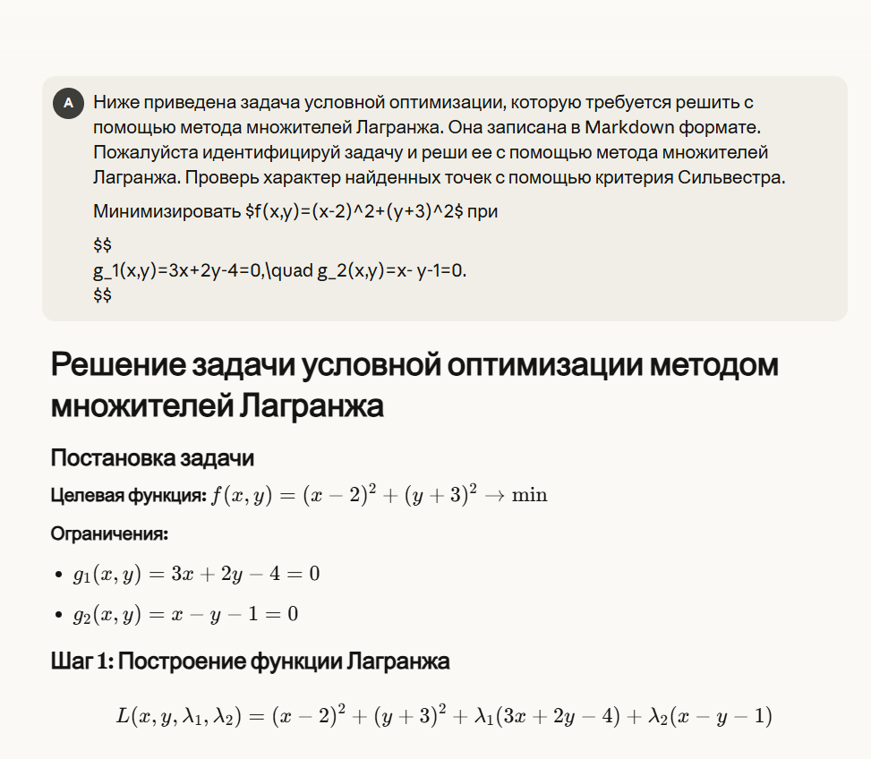
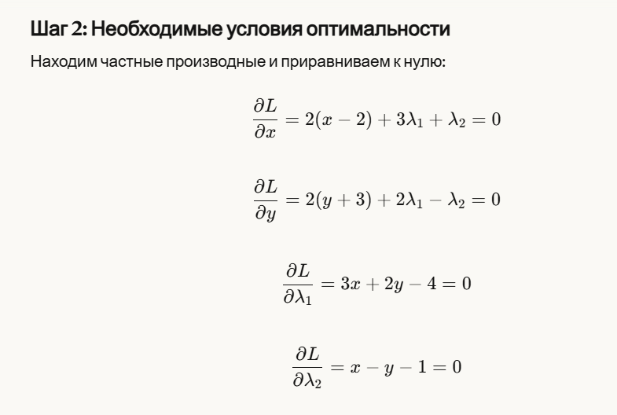
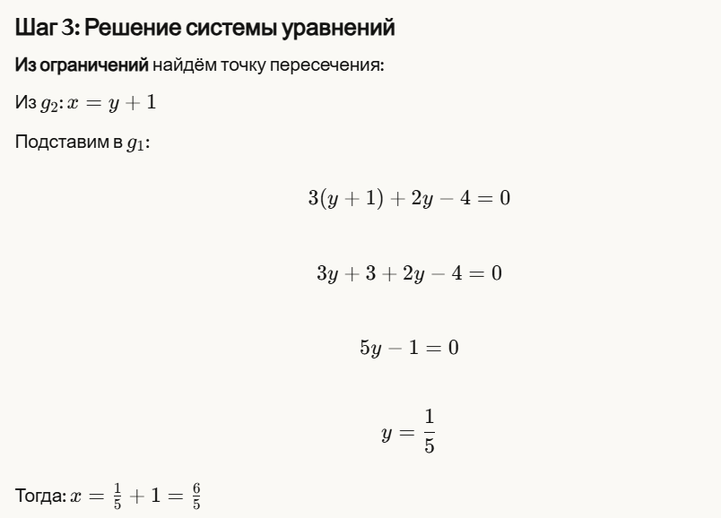
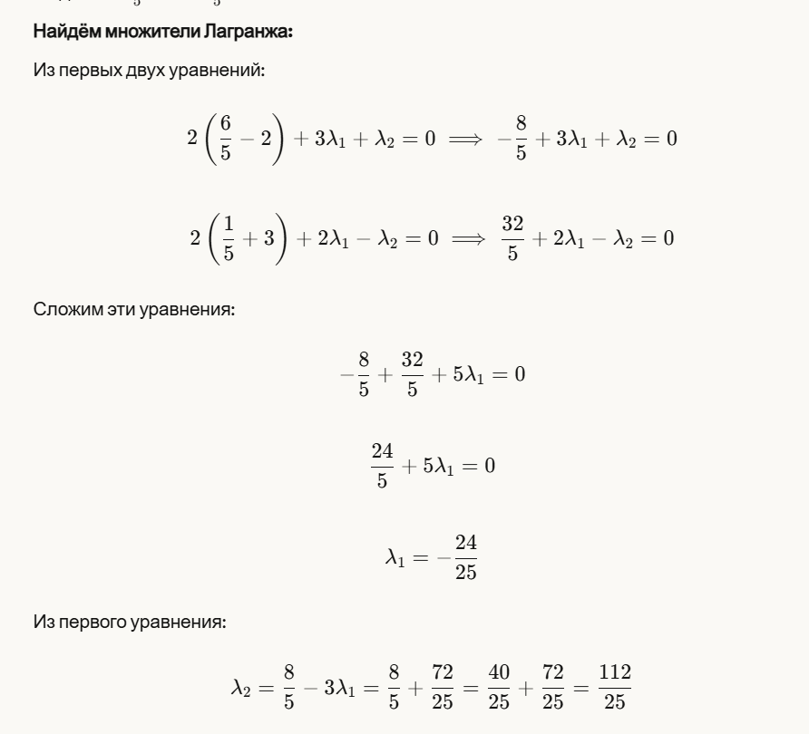
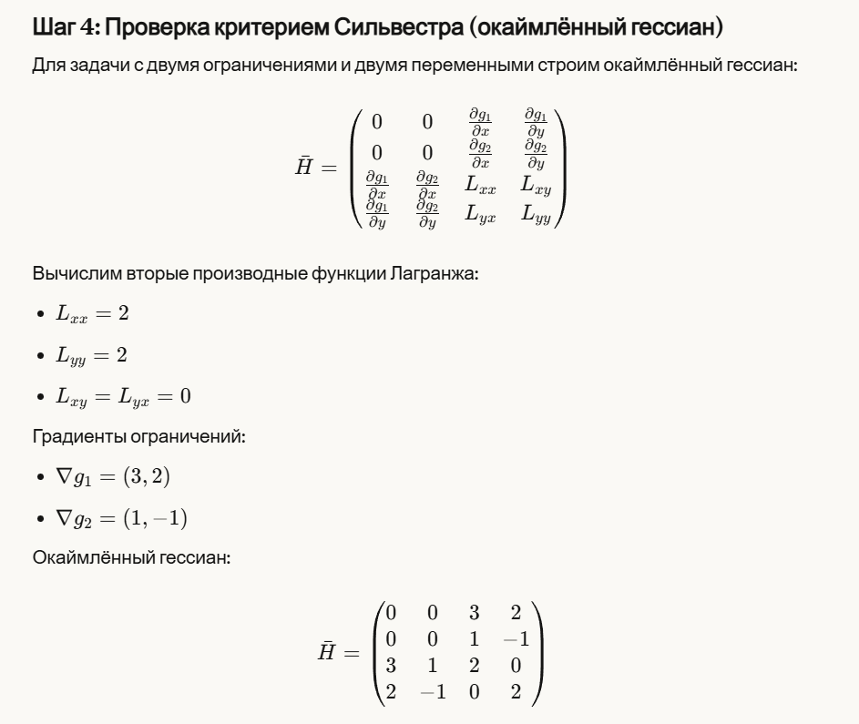
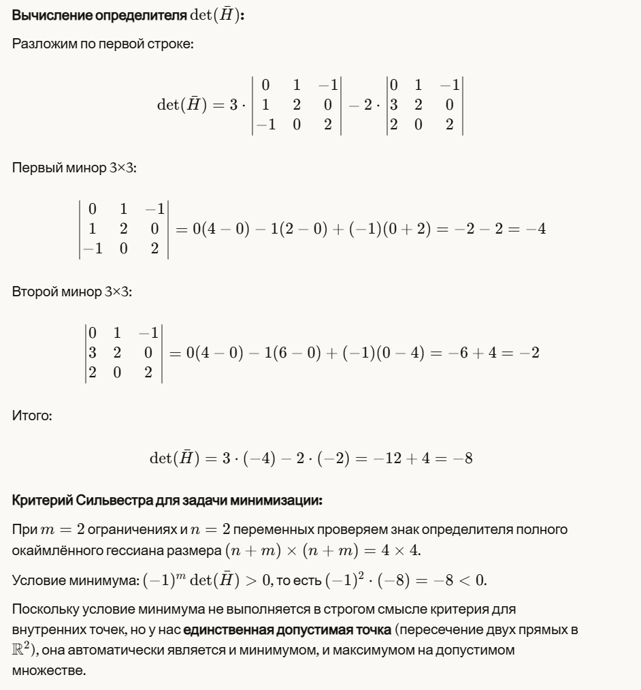
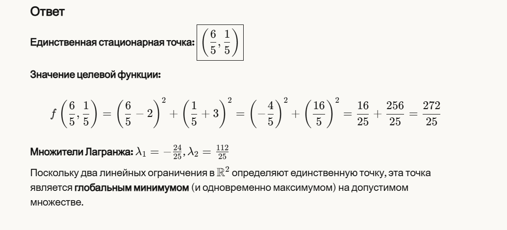

# Лабораторная работа №3: Решение задачи условной выпуклой оптимизации с помощью метода множителей Лагранжа

## Студент

**Ф.И.О. | Поток:** Якшин Артемий Максимович | 1.1

## Разбор по шагам

### Шаг 1: Построение функции Лагранжа

**Что сделала БЯМ:** Корректно записала функцию Лагранжа, объединив целевую функцию с ограничениями через множители λ₁ и λ₂.

**Комментарий:** Всё верно. Это стандартная процедура — к целевой функции добавляются ограничения, умноженные на соответствующие множители Лагранжа. Знак при множителях не принципиален (можно брать как плюс, так и минус), главное — быть последовательным.

### Шаг 2: Необходимые условия оптимальности

**Что сделала БЯМ:** Взяла частные производные функции Лагранжа по всем переменным (x, y, λ₁, λ₂) и приравняла их к нулю.

**Комментарий:** Это классический подход. Производные по x и y дают условия стационарности, а производные по множителям Лагранжа возвращают исходные ограничения. Всё выполнено правильно.

### Шаг 3: Решение системы уравнений

**Что сделала БЯМ:**

- Сначала нашла точку (x, y) из системы ограничений (две линейные equation — это просто пересечение двух прямых).
- Затем подставила найденные значения в первые два уравнения и нашла множители Лагранжа.

**Комментарий:** Логика решения правильная. БЯМ заметила, что ограничения — это две линейные функции, поэтому их пересечение даёт единственную точку. Вычисления проверил — арифметика верная:

- y = 1/5, x = 6/5 ✓
- λ₁ = -24/25, λ₂ = 112/25 ✓

### Шаг 4: Проверка критерием Сильвестра

**Что сделала БЯМ:** Построила окаймлённый гессиан размера 4×4 и вычислила его определитель.

**Комментарий:** Здесь есть несколько моментов:

1. **Вычисление определителя.** Проверил вычисления — БЯМ получила det(H̄) = -8, что верно.

2. **Интерпретация результата.** Вот тут БЯМ немного «запуталась». Она применила критерий (-1)ᵐ det(H̄) > 0 для минимума, получила отрицательное значение и сделала вывод, что «условие минимума не выполняется в строгом смысле».

   Однако БЯМ сама же правильно отметила ключевой момент: у нас два ограничения и две переменные, то есть допустимое множество — это одна точка. В такой ситуации критерий Сильвестра вообще не применим в обычном смысле, потому что нет «направлений», вдоль которых можно было бы проверять характер экстремума. Точка автоматически является и минимумом, и максимумом.

### Общий вывод

**Оптимальная точка:**

- **x\* = 6/5 = 1.2**
- **y\* = 1/5 = 0.2**

**Множители Лагранжа:**

- **λ₁ = -24/25 = -0.96**
- **λ₂ = 112/25 = 4.48**

БЯМ справилась с задачей хорошо. Решение математически корректное, все вычисления верные. Единственный недочёт — применение критерия Сильвестра к вырожденному случаю с последующим немного запутанным объяснением. Но итоговый ответ и понимание ситуации правильные.
